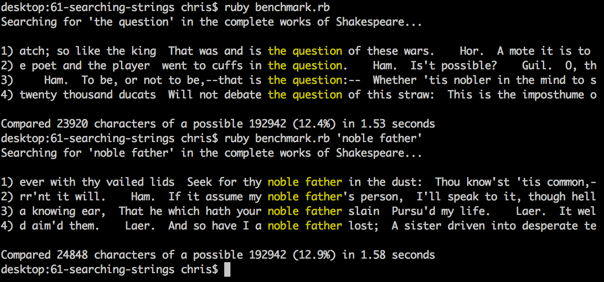

##Searching Strings

This directory contains an implementation of the Boyer–Moore algorithm following
our meeting on the Searching Strings topic. It also includes a benchmark script
that searches for a provided string in the complete works of Shakespeare.

As it searches for a string, this implementation tracks how many comparisons are
made and demonstrates that on average, the Boyer–Moore algorithm runs in
sub-linear time.

##Screenshot

